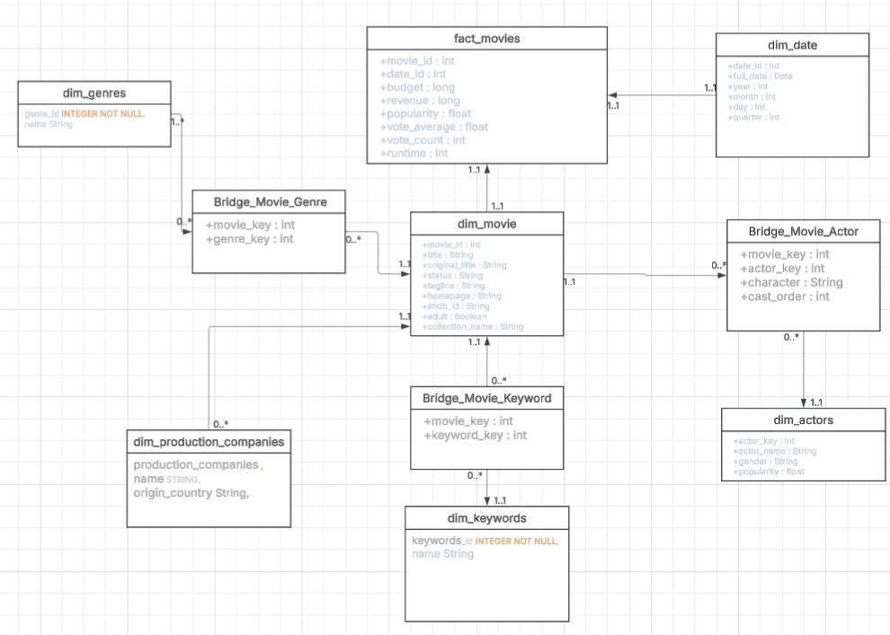
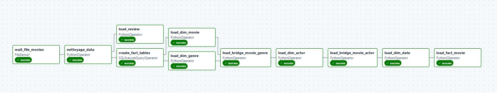

# 🎬 Movie ETL Pipeline - Data Engineering Project

## 📌 Overview

This project is an end-to-end Data Engineering pipeline that collects, transforms,
and stores movie data automatically.

The objective is to build a complete ETL workflow:

**Extract → Transform → Load**

The pipeline extracts movie information from external sources,
cleans and transforms the data, then loads it into a database
for analytics.

---

# 🏗️ Architecture



The pipeline architecture:

      API / CSV Data
            |
            |
        Extraction
      (Python Requests)
            |
            |
      Apache Airflow
          DAG
            |
            |
    Data Transformation
      (Pandas / Python)
            |
            |
      PostgreSQL Database
            |
            |
    Analytics Dashboard

    
---

# ⏱️ Airflow DAG





Apache Airflow is used to orchestrate and automate the ETL pipeline.

The DAG contains the following task

---
# 🚀 Features

✅ Automated data extraction  
✅ ETL pipeline implementation  
✅ Airflow DAG orchestration  
✅ Data cleaning and transformation  
✅ PostgreSQL data storage  
✅ Docker environment  
✅ Data analysis ready dataset


---

# 🛠️ Technologies

## Programming

- Python
- Pandas
- Requests


## Data Engineering

- Apache Airflow
- ETL concepts
- Data pipeline automation


## Database

- PostgreSQL
- SQL
- MongoDb


## Deployment

- Docker
- Docker Compose


---


## 🐳 Installation


Clone the repository:

```bash
git clone https://github.com/karimcherrab/movie-etl-pipeline.git
Install dependencies: pip install -r requirements.txt
Run the project: docker compose up
Access Airflow:http://localhost:8080
Activate the DAG:Activate the DAG:
```

---


##  📈 Future Improvements
 - Add data quality validation
 - Add automated tests
 - Add monitoring and alerts
 - Add Spark for large-scale processing
 - Deploy on cloud platforms
 - Add dashboard with Streamlit or Metabase

---


## 👨‍💻 Author

Karim Cherrab


## ⭐ Skills Demonstrated
 - Python Development
 - ETL Pipeline Design
 - Data Cleaning
 - SQL and PostgreSQL
 - Apache Airflow
 - Docker
 - Data Engineering Workflow
